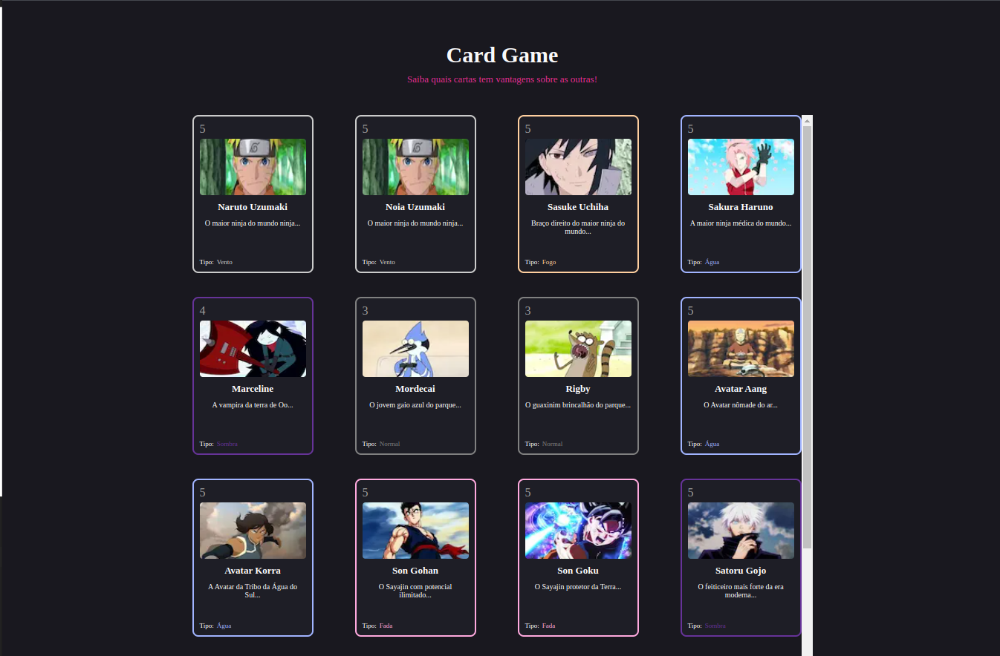
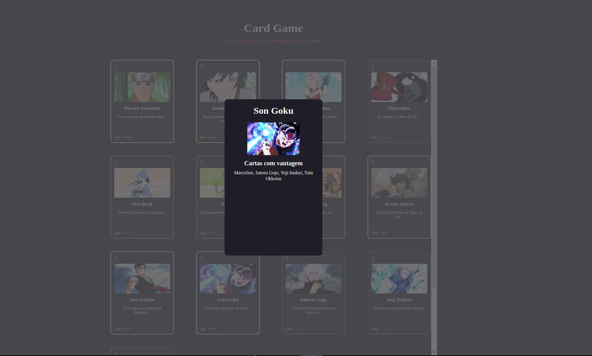

# Card Game
Número da Lista: 20
Conteúdo da Disciplina: Grafos 1

## Alunos
| Matrícula | Aluno |
| ----------| -------------------------|
| 190028122 | Gabriel Sabanai Trindade |
| 211029586 | Sabrina Caldas Berno |

## Sobre
No Card Game você poderá ver um catálogo de cartas para te auxiliará a identificar quais cartas vencem a selecionada e quais não. 
Para esse projeto, iremos utilizar um grafo para organizar as cartas e um algorítmo de busca em largura para identifcar as cartas e seus relacionamentos

Vídeo explicativo da dupla: https://drive.google.com/drive/folders/1PlfuugxXzl9ulSP1b35kADDdkKPA6yxn?usp=sharing

Link do deploy: [http://cardgame.s3-website-us-east-1.amazonaws.com/](http://cardgame.s3-website-us-east-1.amazonaws.com/)

## Screenshots




## Instalação
Linguagem: Javascript 
Framework: Next

Para rodar o projeto, recomendamos utilizar node 20.10.0 e ai basta fazer o download do repositório e rodar este código no terminal:

```
npm install
```

```
npm run dev 
```

O projeto abrirá na url: http://localhost:3000/

## Uso 
Para usar o Card Game, o usuário deve clicar, inicialmente, na carta que ele deseja descobrir sobre quais tem vantagem. Em seguida, o usuário irá visualizar umas lista de cartas que a selecionada vence. Para voltar para a página inicial, basta o usuário clicar em qualquer parte fora da container da carta. 
